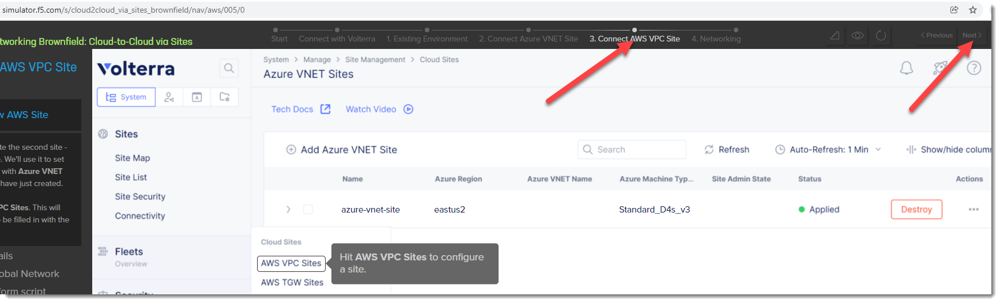

Lab 2: Deploying a Public Cloud Site
================================

In the previous lab you learned how to protect a resource that is already on the Public Internet.

In this next lab we will look at two additional topologies of how you can use a **AppMesh** node
to secure traffic that is going to an endpoint that is not directly exposed to the Internet.

F5 Distributed Cloud Azure VNET Site
---------------------------------

In additional to using the F5 Distributed Cloud WAF from an F5 Regional Edge / PoP location
you can also deploy a **AppMesh** node that enables you to access networks that
are not directly connected to the Internet and/or enforce WAF policies locally 
within the local network.

When we deploy AppMesh outside of a Regional Edge we refer to these locations as a
**Customer Edge**.  In the following exercise we will review the process to
deploy a Customer Edge.  In our existing lab environment we have already deployed 
a shared F5 Distributed Cloud Azure vNet Site.

Once an AppMesh node has been deployed as a Customer Edge it helps provide two
additional topologies for F5 Distributed Cloud WAF protection.

#. Enabling F5 Distributed Cloud to proxy and protext internal services from our Regional Edge (additional DDoS protection, and AnyCast availability) even though it is not directly exposed to the internet.

#. Allow F5 Distributed Cloud to provide WAF protection for **internal** and/or **local** systems

Exercise 1: Introduction to F5 Distributed Cloud Azure VNET Site
^^^^^^^^^^^^^^^^^^^^^^^^^^^^^^^^^^^^^^^^^^^^^^^^^^^^^^^^^^^^^

#. Start in F5 Distributed Cloud Console and find the **Azure VNET Sites** menu item. 

   From the top left **Select service** and look under **All Services** -> **Cloud and Edge Sites**
#. Go to **Manage** -> **Site Management** -> **Azure VNET Sites**

   .. image:: _static/menu-cloud-edge-sites.png
      :width: 75% 

#. Find the **student-azurenet** site

   In this lab environment we have already deployed a shared Azure VNET Site that we will 
   use in this lab.  Click on the **student-azurenet**

   You will be able to observe several metrics about the health of the site.

   .. image:: _static/student-awsnet-site-metrics.png

   
#. Browse back to **Azure VNET Sites**
   
   In this deployment an AppMesh node has been deployed into an existing vNet in our
   shared Azure lab environment.

   AppMesh nodes can also be deployed into VMWare and KVM environments as well through
   a site registration process. 

Exercise 2 (Optional): F5 F5 Distributed Cloud Simulator
^^^^^^^^^^^^^^^^^^^^^^^^^^^^^^^^^^^^^^^^^^^^^^^^^^^^^^^^

During this lab we will not deploy a new Azure VNET Site.  If you would like to learn 
more about deploying a Public Cloud Site via F5 Distributed Cloud you may want to try using the 
following F5 F5 Distributed Cloud Simulator:

- https://simulator.f5.com/s/cloud2cloud_via_sites_brownfield

You can emulate the steps that were used to create the F5 Distributed Cloud Site in the lab environment by starting
with the "3. Connect AWS VPC Site" https://simulator.f5.com/s/cloud2cloud_via_sites_brownfield/nav/aws/005/0

Clicking on the "Next" button in the top right will allow you to see similar steps that were used to create the site.

