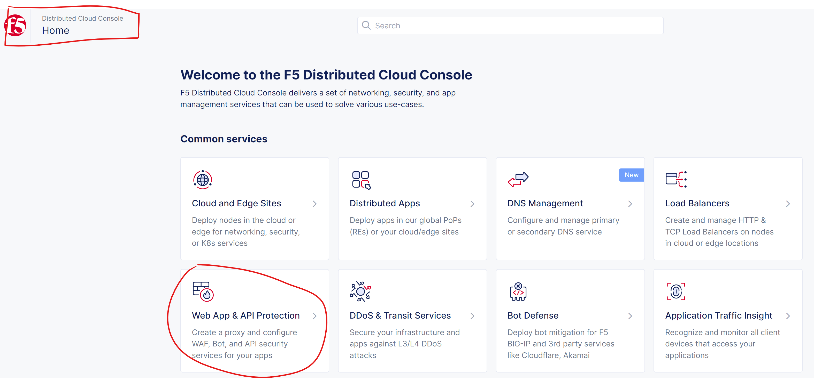
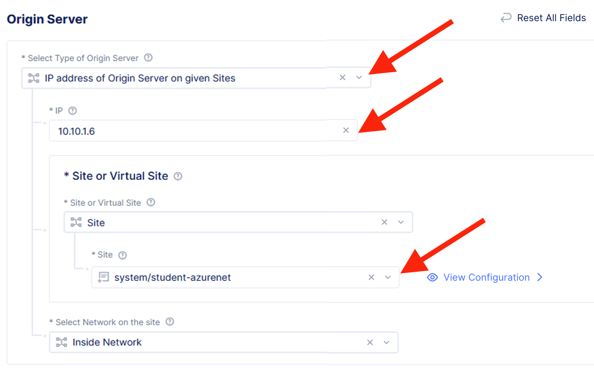
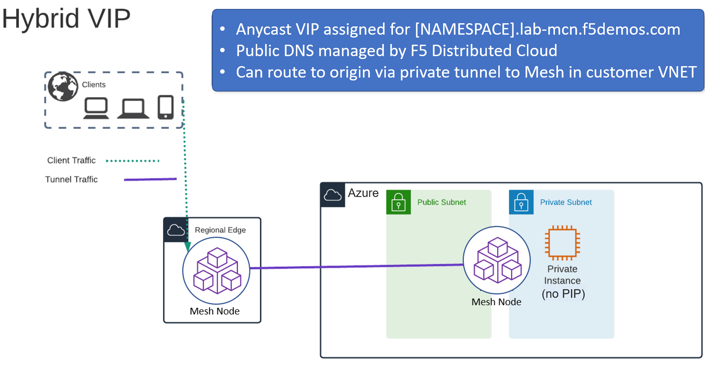
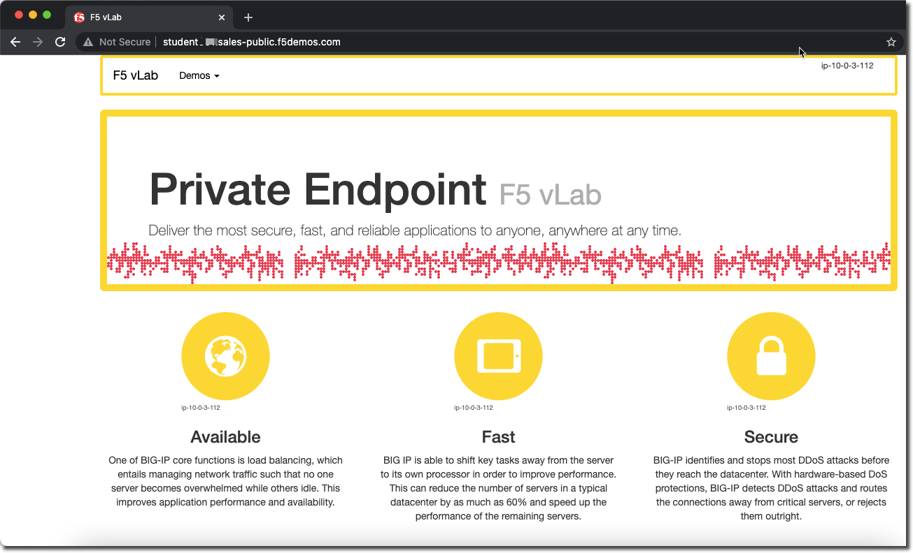
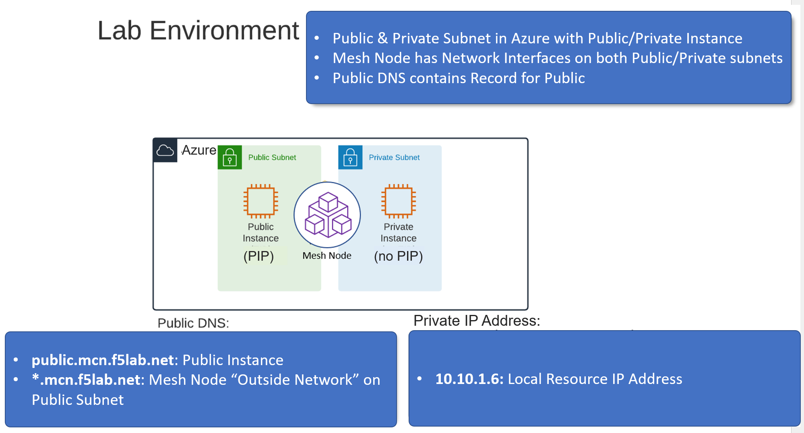
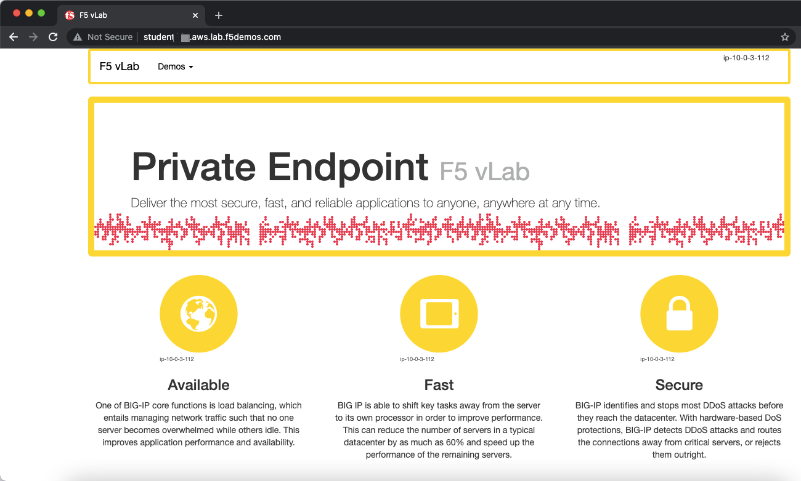

Lab 3: Protecting a Private Endpoint
====================================

In the previous lab you learned how an AppMesh node can be deployed 

In this next lab we will look at two additional topologies of how you can use an **AppMesh** node
to secure traffic that is going to an endpoint that is not directly exposed to the Internet.

Task 1. Create Origin Pools
---------------------------

Previously we created an origin pool that was accessible via the Public Internet.
The next lab exercise will create an origin pool that will provide internal resources targeted via local IP by the AppMesh node that is deployed in our lab Azure environment. 

Exercise 1: Create Private Origin Pool
^^^^^^^^^^^^^^^^^^^^^^^^^^^^^^^^^^^^^^

We will first create an Origin Pool that refers to the **Private Endpoint** site in our lab environment.

#. Start in F5 Distributed Cloud Console and switch back to the **Web App & API Protection** context.

#. Navigate the menu to go to **Manage** -> **Load Balancers** -> **Origin Pools**. Click on **Add Origin Pool**.

#. Enter the following variables:

   ================================= =====
   Variable                          Value
   ================================= =====
   Name                              private
   ================================= =====

#. Click on **Add Item** under the section **Origin Servers**

   Enter the following variables: 

   ================================= =====
   Variable                          Value
   ================================= =====
   Select Type of Origin Server      IP Address of Origin Server on given Sites
   DNS Name                          10.10.1.6
   Site                              student-azurenet
   ================================= =====
    
   |op-pool-basic|

   Click on **Add Item** to return to the previous screen.

#. Below the **Origin Servers** section fill in the Port information

   ================================= =====
   Variable                          Value
   ================================= =====
   Port                              8080
   ================================= =====

#. In **Health Check(s)** section, click the **Add item** button.

#. Click the **Health Check object** dropdown list. Select the **http** monitor that you previously created.

#. Click the **Save and Exit** button to create the Origin Pool.

.. |origin_pools_menu| image:: _static/origin_pools_menu.png
.. |origin_pools_add| image:: _static/origin_pools_add.png
.. |origin_pools_config| image:: _static/origin_pools_config.png
.. |origin_pools_config_api| image:: _static/origin_pools_config_api.png
.. |origin_pools_config_mongodb| image:: _static/origin_pools_config_mongodb.png
.. |origin_pools_show_child_objects| image:: _static/origin_pools_show_child_objects.png
.. |origin_pools_show_child_objects_status| image:: _static/origin_pools_show_child_objects_status.png
.. |http_lb_origin_pool_health_check| image:: _static/http_lb_origin_pool_health_check.png
.. |http_lb_origin_pool_health_check2| image:: _static/http_lb_origin_pool_health_check2.png

.. |op-add-pool| image:: _static/op-add-pool.png
.. |op-api-pool| image:: _static/op-api-pool.png

.. |op-spa-check| image:: _static/op-spa-check.png
.. |op-tshoot| image:: _static/op-tshoot.png

Task 2. Update HTTP Load Balancer on F5 Distributed Cloud Regional Edge
-----------------------------------------------------------------------

We will now update the HTTP load balancer that we previously created to connect to
the **Private Endpoint** via the AppMesh node that is deployed in the AWS lab environment.

Exercise 1: HTTP Load Balancer Configuration
^^^^^^^^^^^^^^^^^^^^^^^^^^^^^^^^^^^^^^^^^^^^

#. Start in F5 Distributed Cloud Console and switch to the **Web App & API Protection** context. [You should already be here from previous lab]

#. Navigate the menu to go to **Manage** -> **HTTP Load Balancers** and look for the Load Balancer named **global** that you previously created.

#. Click on the three action dots "..." to the right of the name of your **global** Load Balancer and select the **Manage Configuration** option.
   
   .. image:: _static/screenshot-global-vip-actions-manage.png
#. Click on **Edit Configuration** in the upper right of the screen (after your **global** Load Balancer is loaded).
   
   .. image:: _static/screenshot-global-vip-edit-config.png
#. Under **Default Origin Servers** find your previous **public** Origin pool and click on the three action dots "..." to the right under **Actions** and select **Edit**
   
   .. image:: _static/screenshot-global-vip-edit-config-pools.png
#. Change the selection of **Origin Pool** to **private** from **public** and click **Apply**
   
   .. image:: _static/screenshot-global-vip-edit-config-pools-select.png
#. Click **Save and Exit** to update the HTTP Load Balancer.

You should now be able to go to the DNS name that you entered 
previously in a web browser.  The FQDN we used in our example is http://stable-sheep.lab-mcn.f5demos.com/.  

Exercise 2: Verify Configuration
^^^^^^^^^^^^^^^^^^^^^^^^^^^^^^^^

The private demo app should look like the following:

In this topology we are sending traffic to an AnyCast IP that is hosted in F5 Distributed Cloud's Regional Edge.

We then connect to the Azure resource via the AppMesh node that is deployed in the same VNET as the **Private Endpoint**.  
The AppMesh is only being used for network connectivity to the Private Endpoint; enforcement of the WAF policy is still
being applied in the Regional Edge.

In the next exercise we will look at a third topology of deploying a WAF policy that will be enforced within the Azure VNET
on the AppMesh node (in the Customer Edge).

Task 3. Creating HTTP Load Balancer on F5 Distributed Cloud Customer Edge
-------------------------------------------------------------------------

In the previous lab exercises we were connecting to a F5 Distributed Cloud Load Balancer that was deployed in a Regional Edge.

In the next lab exercise we will deploy a Load Balancer on the AppMesh node that was deployed in the Azure VNET (Customer Edge location).

Exercise 1: HTTP Load Balancer Configuration
^^^^^^^^^^^^^^^^^^^^^^^^^^^^^^^^^^^^^^^^^^^^

#. Start in F5 Distributed Cloud Console and switch to the **Web App & API Protection** context. [You should already be here from previous lab]

#. Navigate the menu to go to **Manage** -> **HTTP Load Balancers** and click on **Add HTTP Load Balancers**.

#. Enter the following variables:

   ================================= =====
   Variable                          Value
   ================================= =====
   Name                              local
   Domains                           [NAMESPACE].mcn.f5lab.net
   Select type of Load Balancer      HTTP
   Automatically Manage DNS Records  No/Unchecked 
   ================================= =====

Exercise 2: Configure Default Origin Server
^^^^^^^^^^^^^^^^^^^^^^^^^^^^^^^^^^^^^^^^^^^

We'll next configure the **Default Origin Servers**.   
    
#. Click on the **Add Items** link under the **Default Origin Servers** section.

#. The **Select Origin Pool Method** will be set to **Origin Pool**. Under the **Origin Pool** dropdown menu select the **private** pool you created earlier.
 
#. Click the **Add Item** button to exit the **Origin Pools** dialogue.

Exercise 3: Configure Local VIP
^^^^^^^^^^^^^^^^^^^^^^^^^^^^^^^

Previously we configured a VIP that was advertised on F5's Regional Edge (PoP) locations.
We will modify this configuration to expose the service on the **Outside** interface of the AppMesh
node that is deployed in Azure.  This will allow us to access the VIP via the Public IP Address (Azure Public IP)
that is attached to that interface.  If we wished to only have the service available within the Azure VNET
we could opt to use the **Inside** interface that does not have an Azure PIP attached.

#. Under **Advanced Configuration** set **Where to Advertise the VIP** to **Custom**
   
   .. image:: _static/screenshot-local-vip-advertise-custom.png
   
#. Click on **Configure** under **Custom**
#. In **List of Sites to Adverstise**, click on **Add Item**
#. For **Site Network** click on **Outside Network** 
#. For **Site Reference** select **system/student-azurenet**

   .. image:: _static/lb-local-vip-advertise.png
      :width: 75%
	  
#. Click on **Add Item**
#. Click on **Apply** to return to previous screen

Exercise 4: Configure WAF Policy
^^^^^^^^^^^^^^^^^^^^^^^^^^^^^^^^

#. Under the **Security Configuration** section 

#. Enter the following variables:

   ============================================= =====================
   Variable                                      Value
   ============================================= =====================
   Select Web Application Firewall (WAF) Config  App Firewall
   App Firewall                                  blocking-app-firewall
   ============================================= =====================

#. Click **Save and Exit** to create the HTTP Load Balancer.

Once the HTTP Load Balancer has been deployed, you should now be able to go to the DNS name that you entered 
previously in a web browser.  The FQDN we used in our example is http://stable-sheep.mcn.f5lab.net.  
This is a wildcard DNS entry that points to the Public IP (Azure Public IP) that is attached to the AppMesh node.

Exercise 5: Verify Configuration
^^^^^^^^^^^^^^^^^^^^^^^^^^^^^^^^

The private demo app should look like the following:

Exercise 6: Verify DNS
^^^^^^^^^^^^^^^^^^^^^^

You can verify that you are connecting directly to Azure by comparing the DNS of the two hosts.

.. code-block:: 

   $dig +short [YOUR NAMESPACE].mcn.f5lab.net
   20.51.104.213

.. code-block:: 

   nslookup [YOUR NAMESPACE].mcn.f5lab.net
   
   Non-authoritative answer:
   Name:	[YOUR NAMESPACE].mcn.f5lab.net
   Address: 20.51.104.213

In this topology we are sending traffic to the Azure PIP that attached to the AppMesh node in the Azure VNET.

We then connect to the Azure resource via it's Private IP address.  

Try adding the following to the URL "?cat%20/etc/passwd".

You should see a block page.  This is similar behavior to what we saw in the previous lab,
but in this case the enforcement of the WAF policy is occurring on the AppMesh node
that is deployed in the Azure Lab Environment and not in the F5 Distributed Cloud Regional Edge.

In the next lab we will look at how to customize our WAF policy.
